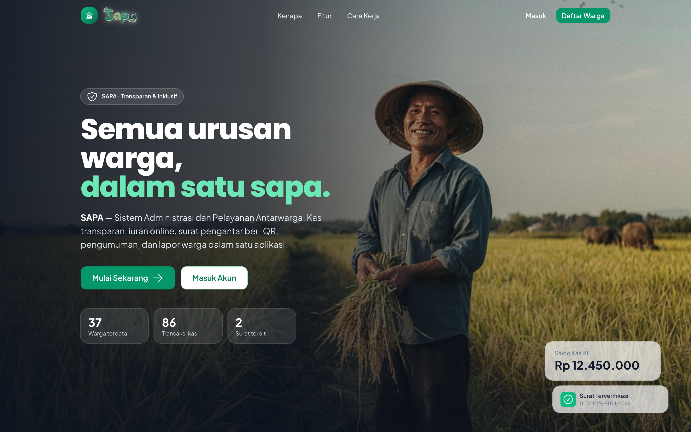
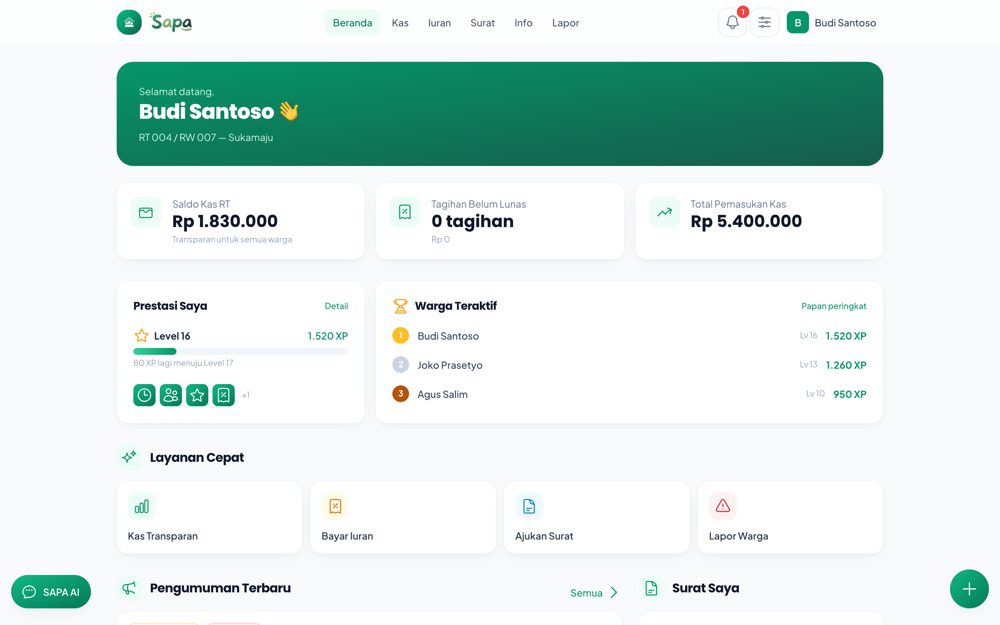
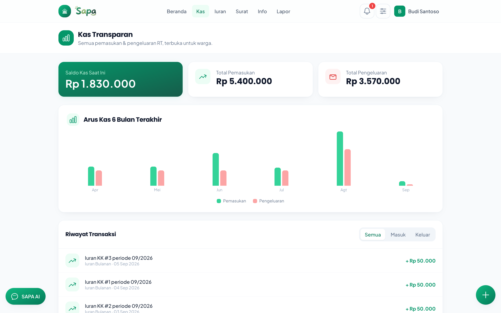
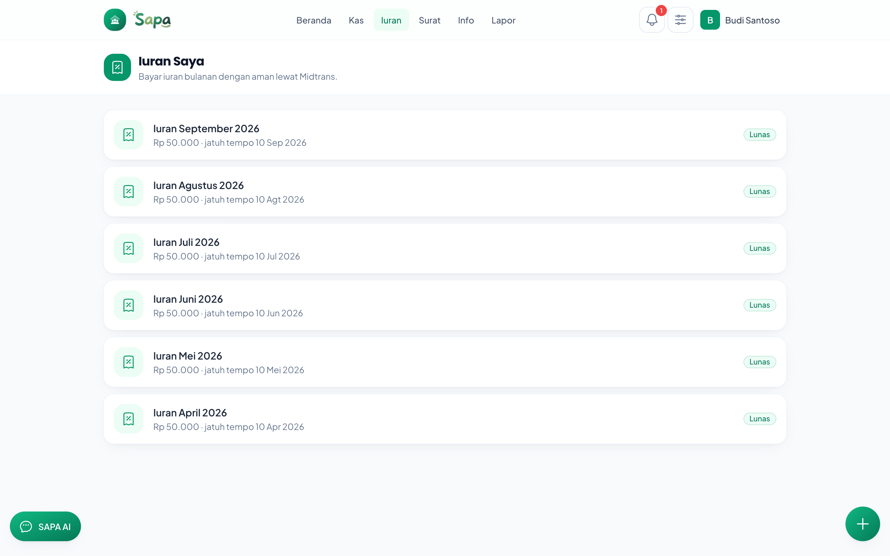
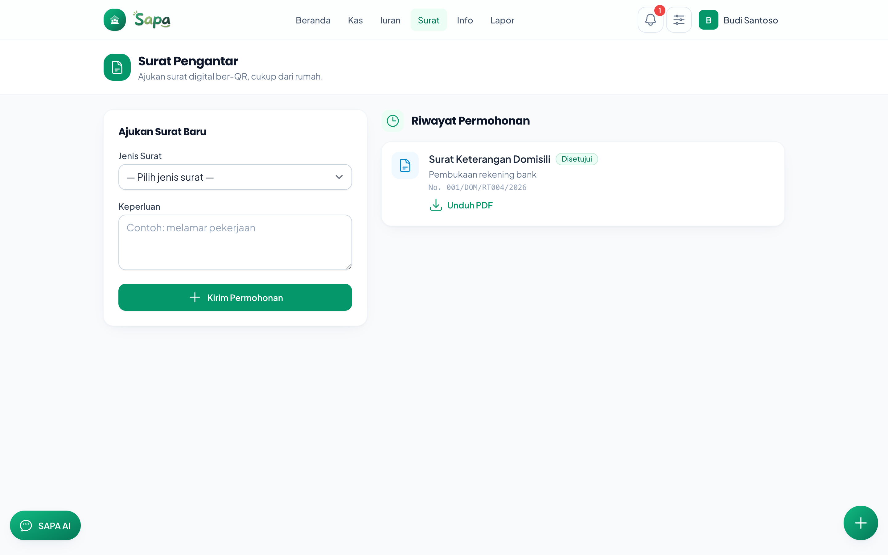
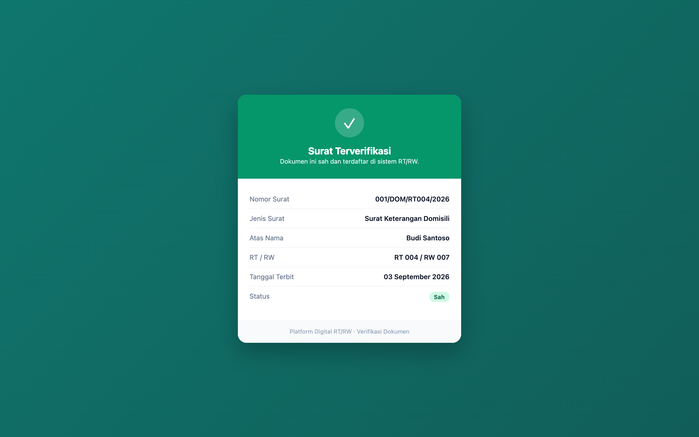
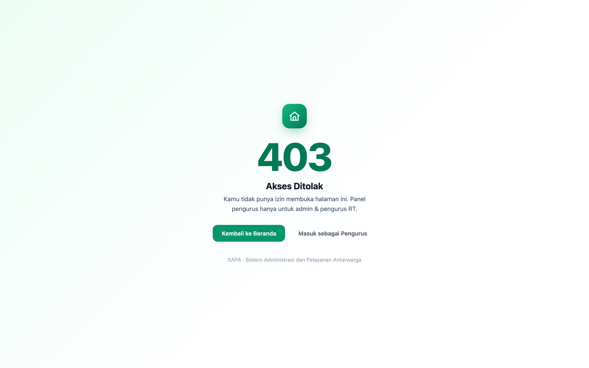
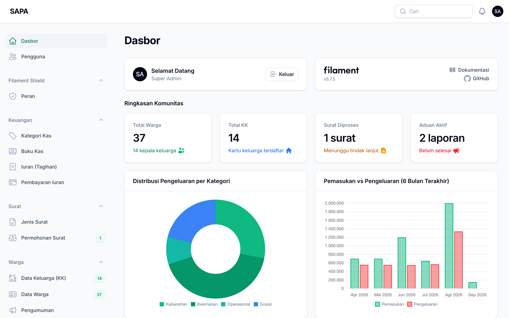
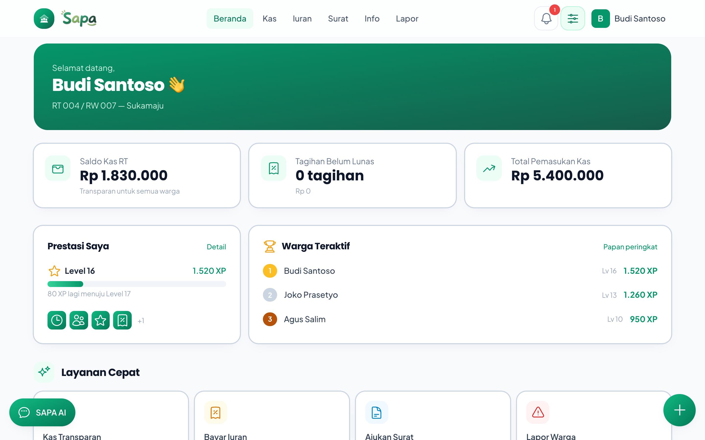

# 🏘️ Platform Digital RT/RW

> **Smart Sustainable Digital Solution for Inclusive Society**
> Satu aplikasi untuk seluruh warga: kas transparan, iuran online, surat pengantar digital ber-QR, pengumuman, dan lapor warga.

<p align="center">
  
  
  
  
  
</p>

---

## 📖 Daftar Isi

1. [Penjelasan Aplikasi](#-penjelasan-aplikasi)
2. [Fitur Utama](#-fitur-utama)
3. [Teknologi yang Digunakan](#-teknologi-yang-digunakan)
4. [Relevansi Tema & SDG](#-relevansi-tema--sdg)
5. [Screenshot](#-screenshot)
6. [Akun Demo](#-akun-demo)
7. [Cara Instalasi](#-cara-instalasi)
8. [Cara Penggunaan](#-cara-penggunaan)
9. [Deployment](#-deployment)
10. [Struktur & Arsitektur](#-struktur--arsitektur)
11. [Checklist QA](#-checklist-qa-kesiapan-demo)

---

## 🎯 Penjelasan Aplikasi

### Latar Belakang

Pengelolaan RT/RW di Indonesia masih banyak dilakukan secara manual dan menimbulkan masalah klasik:

- **Kas tidak transparan** — warga jarang tahu ke mana uang iuran mengalir; laporan keuangan hanya dibacakan sesekali di rapat.
- **Informasi tercecer** — pengumuman tersebar di banyak grup WhatsApp dan mudah tenggelam.
- **Birokrasi surat ribet** — untuk surat pengantar (domisili, SKTM, usaha) warga harus bolak-balik menemui pengurus.
- **Iuran merepotkan** — pembayaran harus tunai dan bertemu bendahara, sering terlambat.
- **Laporan warga tak jelas tindak lanjutnya** — keluhan lingkungan hilang tanpa kabar.

### Tujuan

**Platform Digital RT/RW** mendigitalkan seluruh layanan RT/RW dalam satu aplikasi yang **transparan, cepat, dan inklusif**:

- Membuka buku kas RT secara **real-time** kepada semua warga.
- Memungkinkan **pembayaran iuran online** yang praktis.
- Menyediakan **surat pengantar digital ber-QR** yang bisa diverifikasi publik.
- Menyatukan **pengumuman** dan kanal **lapor warga** yang terlacak statusnya.
- Ramah untuk **semua kalangan**, termasuk lansia (mode inklusif).

Aplikasi memiliki **dua permukaan**:

| Permukaan | Pengguna | Teknologi |
|-----------|----------|-----------|
| **Panel Admin** (`/admin`) | Super Admin & Pengurus | Filament (dengan Filament Shield untuk role & permission) |
| **Aplikasi Warga** (`/`) | Warga | Blade + Livewire + Tailwind (mobile-first, responsif) |

---

## ✨ Fitur Utama

### 1. 💰 Kas Transparan (keunggulan utama)
Seluruh transaksi pemasukan & pengeluaran RT terbuka untuk **semua warga** (read-only), lengkap dengan **grafik arus kas bulanan** dan saldo real-time. Transparansi keuangan = kepercayaan warga.

### 2. 🧾 Iuran Online (Midtrans)
Warga melihat tagihan iuran (lunas/menunggak) dan membayar langsung lewat **Midtrans Snap**. Saat pembayaran berhasil, webhook memvalidasi *signature*, status iuran otomatis **lunas**, dan **satu baris pemasukan kas** tercatat otomatis — idempoten (tidak dobel walau webhook diulang).

### 3. 📄 Surat Pengantar Digital + QR Verifikasi
Warga mengajukan surat (Domisili, SKTM, Pengantar Usaha) dengan field tambahan dinamis. Pengurus menyetujui → sistem meng-generate **nomor surat otomatis** (`001/DOM/RT04/2026`, aman dari *race condition*), **PDF ber-kop**, dan **QR code**. Siapa pun bisa memindai QR / membuka `/verify/{token}` untuk **memastikan keaslian surat** — tanpa login.

### 4. 📣 Pengumuman
Feed pengumuman dengan kategori & **prioritas pin**, mendukung penjadwalan tayang (`published_at`) dan lampiran. Bisa dibagikan ke **WhatsApp**.

### 5. 🚨 Lapor Warga
Warga melaporkan masalah lingkungan (foto + kategori + lokasi). Pengurus mengubah status **reported → in_progress → resolved**, dan warga bisa **melacak timeline penanganan**. Pengurus juga menerima **notifikasi in-app** saat ada laporan baru.

### 6. ♿ Mode Inklusif (pembeda tema)
Toggle satu klik untuk **memperbesar teks & menaikkan kontras** — nyaman bagi warga lanjut usia atau berkebutuhan khusus. Preferensi tersimpan di perangkat.

### 7. 🎮 Gamifikasi + Belajar Sambil Bermain
Setiap aktivitas (bayar iuran, ajukan surat, lapor warga) memberi **XP**; warga **naik level**, membuka **8 badge** (Warga Teladan, Rajin Bayar Iuran, dll), dan masuk **papan peringkat**. Ada halaman **Profil & Prestasi** dan **3 mini-game edukasi** — "Pilah Sampah 3D" (Three.js/WebGL, drag & drop), "Kuis Administrasi", dan "Tebak Jenis Surat" (pilihan ganda) — yang juga memberi XP (dibatasi harian per game). XP dihitung idempoten lewat observer — mendorong partisipasi & gotong royong digital.

### 8. 🤖 SAPA AI (asisten FAQ)
Chatbot mengambang yang menjawab pertanyaan RT/RW **dan terhubung data asli** ("iuran saya berapa?", "saldo kas RT", "status surat saya") dengan tombol aksi cepat. Berbasis intent (tanpa biaya API), mudah di-upgrade ke LLM.

### 9. ✨ Polish Visual & Aksesibilitas
Glassmorphism, animasi halus + scroll reveal, **confetti** saat pembayaran berhasil, **toast** notification, **FAB** aksi cepat, dan **loading screen** — semua menghormati `prefers-reduced-motion` demi perangkat low-end.

---

## 🛠️ Teknologi yang Digunakan

| Teknologi | Versi | Peruntukan dalam proyek ini |
|-----------|-------|------------------------------|
| **Laravel** | 13 | Framework backend utama: routing, Eloquent ORM, migration, validasi, dan seluruh *business logic*. |
| **PHP** | 8.3+ | Bahasa pemrograman; memakai *backed enum* untuk semua status (UserStatus, DuesStatus, dll). |
| **Filament** | 5 | Membangun **panel admin pengurus** (`/admin`): Resource CRUD, tabel, form, action, dan **widget dashboard** (saldo & grafik). |
| **Filament Shield** (bezhanSalleh) | 4 | **Role & permission** berbasis Spatie: role `super_admin`, `pengurus`, `warga` beserta permission per-resource + policy. |
| **Spatie Laravel Permission** | 8 | Mesin RBAC di balik Filament Shield (relasi role–permission–user). |
| **Livewire** | 4 | Komponen interaktif reaktif di sisi warga, khususnya **halaman Iuran** (daftar tagihan + tombol bayar yang memicu Midtrans Snap). |
| **Tailwind CSS** | 3 | *Design system* aplikasi warga: palet brand, komponen reusable (card, button, badge, empty state), responsif mobile-first. |
| **Alpine.js** | 3 | Interaktivitas ringan di Blade: menu, dropdown, field surat dinamis, toggle Mode Inklusif. |
| **Midtrans PHP SDK** | 2 | **Payment gateway** iuran online (Snap): pembuatan token & verifikasi *signature* webhook (mode Sandbox). |
| **barryvdh/laravel-dompdf** | 3 | **Generate PDF surat** murni PHP (tanpa headless Chrome) — mudah di-deploy di hosting apa pun. |
| **simplesoftwareio/simple-qrcode** | 4 | Membuat **QR code** verifikasi (format SVG inline, tanpa perlu ekstensi imagick). |
| **Laravel Breeze** | 2 (stack Blade) | Scaffolding autentikasi warga (register, login, reset password) yang kemudian di-*restyle* sesuai branding. |
| **canvas-confetti** | 1 | Efek **confetti** saat pembayaran berhasil (dengan penghormatan `prefers-reduced-motion`). |
| **Three.js** | 0.18x | Mesin **3D/WebGL** untuk mini-game edukasi "Pilah Sampah 3D" (scene, drag & drop, animasi). Bundle terpisah, hanya dimuat di halaman game. |
| **Vite** | 8 | *Bundler* aset front-end (CSS/JS). |
| **PHPUnit** | 12 | *Automated testing* — 88 test mencakup auth, iuran+Midtrans, surat+QR, pengumuman, lapor warga, dan gamifikasi. |

> Basis data default **SQLite** (nol-konfigurasi untuk demo). Dapat diganti ke **MySQL/PostgreSQL** lewat `.env` tanpa perubahan kode.

---

## 🌍 Relevansi Tema & SDG

**Tema: _Smart Sustainable Digital Solution for Inclusive Society_**

| Aspek | Bagaimana aplikasi menjawabnya |
|-------|-------------------------------|
| **Smart** | Otomatisasi penuh: penomoran surat, pencatatan kas dari pembayaran, verifikasi QR, notifikasi laporan. |
| **Sustainable** | *Paperless* (surat & laporan digital), PDF pure-PHP hemat sumber daya, mengurangi mobilitas fisik warga. |
| **Digital Solution** | Menggantikan proses manual RT/RW (buku kas, arsip surat, grup chat) dengan satu platform terpadu. |
| **Inclusive Society** | **Mode Inklusif** (teks besar & kontras tinggi) untuk lansia/difabel; transparansi kas menumbuhkan kepercayaan; UI sederhana lintas usia. |

### 🎯 SDG 11 — Sustainable Cities and Communities

Aplikasi mendukung **SDG 11: Kota dan Permukiman yang Berkelanjutan** pada unit terkecil masyarakat (RT/RW):

- **11.3** — Urbanisasi inklusif & partisipatif: kanal lapor warga + transparansi kas mendorong partisipasi warga dalam tata kelola lingkungan.
- **11.a** — Memperkuat tata kelola komunitas melalui administrasi digital yang akuntabel.

Turut mendukung **SDG 16 (Institusi yang akuntabel & transparan)** lewat buku kas terbuka dan jejak setiap transaksi.

---

## 📸 Screenshot

> Tangkapan layar aktual (retina 2×) dari data demo — tersimpan di `docs/screenshots/`.

| Halaman | Screenshot |
|---------|-----------|
| **Landing Page** |  |
| **Dashboard Warga** |  |
| **Kas Transparan (grafik)** |  |
| **Iuran Saya + Midtrans Snap** |  |
| **Surat + Download PDF** |  |
| **Verifikasi QR Publik** |  |
| **Lapor Warga (timeline)** |  |
| **Panel Admin (Filament)** |  |
| **Mode Inklusif** |  |

---

## 🔑 Akun Demo

Semua akun memakai kata sandi: **`password`**

| Peran | Email | Akses |
|-------|-------|-------|
| **Super Admin** | `admin@rtrw.test` | Panel `/admin` — akses penuh |
| **Pengurus (Ketua)** | `pengurus@rtrw.test` | Panel `/admin` — kelola kas, iuran, surat, pengumuman, laporan |
| **Warga** | `warga@rtrw.test` | Aplikasi warga `/` — sudah terverifikasi, punya tagihan & surat |

Akun tambahan untuk mendemokan alur verifikasi warga & peran pengurus:

| Peran | Email | Status |
|-------|-------|--------|
| Pengurus (Bendahara) | `bendahara@rtrw.test` | aktif |
| Pengurus (Sekretaris) | `sekretaris@rtrw.test` | aktif |
| Warga (menunggu) | `pending@rtrw.test` | **pending** — untuk diverifikasi pengurus |
| Warga (ditolak) | `ditolak@rtrw.test` | **rejected** |
| Warga lain (leaderboard) | `warga2@rtrw.test` … `warga8@rtrw.test` | aktif, punya XP & badge berbeda-beda |

---

## ⚙️ Cara Instalasi

### Prasyarat
- PHP **8.3+** (ekstensi: `gd`, `dom`, `mbstring`, `sqlite3`)
- Composer 2
- Node.js 20+ & npm

### Langkah

```bash
# 1. Clone repositori
git clone <url-repositori> rtrw
cd rtrw

# 2. Install dependency PHP
composer install

# 3. Install dependency & build aset front-end
npm install
npm run build

# 4. Siapkan environment
cp .env.example .env
php artisan key:generate

# 5. Siapkan database SQLite (default)
touch database/database.sqlite

# 6. Migrasi + isi data demo yang kaya
php artisan migrate:fresh --seed

# 7. Symlink storage (agar foto & PDF bisa diakses publik)
php artisan storage:link
```

> **Midtrans (opsional untuk demo pembayaran):** daftar di [dashboard.midtrans.com](https://dashboard.midtrans.com) (pilih environment **Sandbox**), lalu isi `MIDTRANS_SERVER_KEY`, `MIDTRANS_CLIENT_KEY`, dan `MIDTRANS_MERCHANT_ID` di `.env`. Tanpa kunci, seluruh fitur lain tetap berjalan.

---

## 🚀 Cara Penggunaan

### Menjalankan (development)

```bash
# Terminal 1 — server aplikasi
php artisan serve

# Terminal 2 — Vite (hot reload aset)
npm run dev
```

Buka **http://localhost:8000**.

- Aplikasi warga: **http://localhost:8000**
- Panel admin: **http://localhost:8000/admin**
- Verifikasi surat publik: **http://localhost:8000/verify/{qr_token}**

### Alur demo yang disarankan

1. Buka **landing page**, klik _Masuk_.
2. Login sebagai **warga** (`warga@rtrw.test`) → jelajahi Dashboard, **Kas Transparan** (grafik), **Iuran** (klik Bayar → Midtrans Snap), **Surat** (unduh PDF), **Pengumuman**, **Lapor Warga**.
3. Aktifkan **Mode Inklusif** (ikon geser di kanan atas) untuk memperlihatkan aksesibilitas.
4. Buka PDF surat yang sudah disetujui, **pindai QR**-nya → halaman verifikasi publik muncul.
5. Login sebagai **pengurus** (`pengurus@rtrw.test`) di `/admin` → setujui surat pending, ubah status laporan, generate tagihan iuran massal.

### Menjalankan test

```bash
php artisan test
```

---

## ☁️ Deployment

Lihat panduan lengkap di **[DEPLOY.md](DEPLOY.md)**.

> ⚠️ **PENTING:** Laravel adalah aplikasi **server-side (PHP + database)**. **Netlify & Vercel TIDAK cocok** untuk menjalankan backend Laravel (keduanya untuk situs statis/JS). Gunakan **Railway, Render, Laravel Cloud, atau VPS**. Detail langkah ada di `DEPLOY.md`.

---

## 🏗️ Struktur & Arsitektur

- **Enums** (`app/Enums`) — seluruh status memakai PHP *backed enum* (`HasLabel` + `HasColor` untuk badge konsisten).
- **Services** (`app/Services`) — logika inti terisolasi & teruji: `MidtransService`, `LetterService`, `ComplaintService`, `DuesGenerator`.
- **Observers** (`app/Observers`) — efek samping otomatis & idempoten: `DuesPaymentObserver` (settle iuran → kas), `ComplaintObserver` (timeline + notifikasi).
- **Filament Resources** (`app/Filament`) — panel pengurus + widget.
- **Livewire** (`resources/views/components/⚡*`) — komponen warga interaktif.
- **Design system** (`resources/views/components/ui`) — komponen Blade reusable.
- **Skema database** — didokumentasikan di [`docs/database-schema.md`](docs/database-schema.md).

---

## ✅ Checklist QA (Kesiapan Demo)

- [x] `php artisan migrate:fresh --seed` mengisi data demo yang kaya (14 KK, 37 warga, 84 iuran, 86 transaksi, surat 3 status, 4 laporan, XP & badge terisi).
- [x] 88 *automated test* lulus (`php artisan test`).
- [x] Akun demo (super_admin, pengurus, warga) berfungsi.
- [x] Aplikasi warga responsif di HP & desktop.
- [x] Mode Inklusif berfungsi (teks membesar + kontras).
- [ ] **(Produksi)** Midtrans Sandbox key terpasang & webhook `https://<domain>/midtrans/callback` teruji.
- [ ] **(Produksi)** `/verify/{token}` dapat diakses publik di domain live (HTTPS).
- [ ] **(Produksi)** `APP_URL` = domain HTTPS produksi (memastikan URL QR benar).
- [ ] **(Produksi)** Screenshot fitur utama dilampirkan di `docs/screenshots/`.

---

<p align="center">Dibuat dengan ❤️ untuk warga — Platform Digital RT/RW</p>
