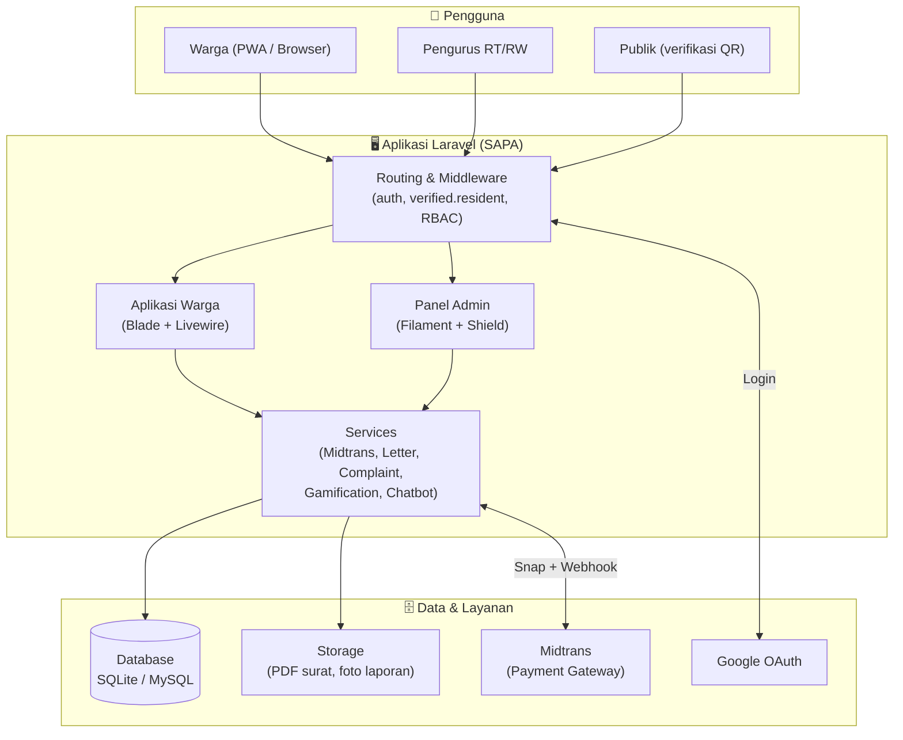
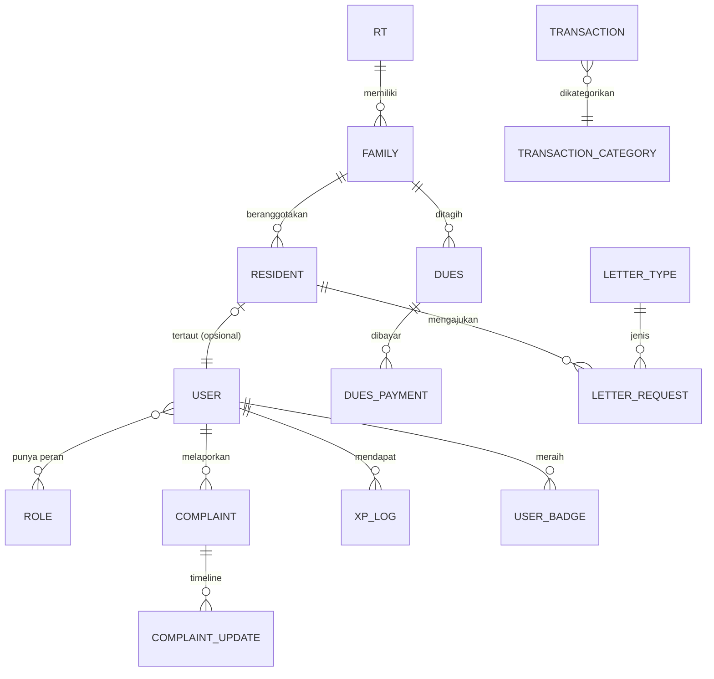

<div align="center">

# SAPA

### Sistem Administrasi dan Pelayanan Antarwarga — Platform Digital RT/RW

_"Semua urusan warga, dalam satu sapa."_

[](https://sapa-rtrw-production.up.railway.app)
[](https://github.com/RafifHamzah/sapa-rtrw)
[](LICENSE)

**Submission for ITECHNO CUP 2026 - Web Development**

**By RafifHamzah**

</div>

---

## 📋 Daftar Isi

- [Tentang Proyek](#-tentang-proyek)
- [Fitur Unggulan](#-fitur-unggulan)
- [Demo & Screenshot](#-demo--screenshot)
- [Teknologi](#-teknologi)
- [Arsitektur Sistem](#-arsitektur-sistem)
- [Instalasi & Setup](#-instalasi--setup)
- [Penggunaan](#-penggunaan)
- [API & Rute Penting](#-api--rute-penting)
- [Testing](#-testing)
- [Tim Pengembang](#-tim-pengembang)
- [Lisensi](#-lisensi)

---

## 🎯 Tentang Proyek

### Latar Belakang

Pengelolaan RT/RW di Indonesia masih banyak dilakukan secara manual, dan menimbulkan masalah klasik yang berulang di hampir setiap lingkungan:

- **Kas tidak transparan** — warga jarang tahu ke mana uang iuran mengalir; laporan keuangan hanya dibacakan sesekali saat rapat.
- **Iuran ribet & rawan salah catat** — pembayaran tunai dari rumah ke rumah memakan waktu dan sulit direkap.
- **Informasi tercecer** — pengumuman tersebar di banyak grup WhatsApp dan mudah tenggelam.
- **Birokrasi surat berbelit** — untuk surat pengantar (domisili, SKTM, usaha) warga harus bolak-balik menemui pengurus.
- **Aspirasi warga tidak tersalur** — keluhan (jalan rusak, sampah, keamanan) sering hanya jadi obrolan tanpa tindak lanjut yang terlacak.

### Solusi yang Ditawarkan

**SAPA** menyatukan seluruh urusan warga ke dalam satu aplikasi web yang **inklusif, transparan, dan mudah dipakai semua kalangan**:

- Kas RT ditampilkan **real-time & terbuka** untuk semua warga, lengkap dengan grafik.
- Iuran bisa **dibayar online** lewat Midtrans, dengan tagihan otomatis dan status yang jelas.
- Surat pengantar diajukan online dan terbit sebagai **PDF ber-QR** yang bisa diverifikasi publik — mencegah pemalsuan.
- Pengumuman, laporan warga (dengan **timeline penanganan**), dan pelayanan lain terpusat di satu tempat.
- Ditambah **gamifikasi**, **asisten AI (SAPA AI)**, **mini-game edukasi**, **Mode Inklusif** (perbesar teks & kontras), dan **PWA** yang bisa dipasang di HP layaknya aplikasi asli.

### Tujuan Proyek

- 🎯 **Tujuan Utama**: Mendigitalkan administrasi & pelayanan RT/RW agar transparan, efisien, dan bisa diakses seluruh warga.
- 📊 **Target Pengguna**: Warga (semua usia), pengurus RT/RW (ketua, bendahara, sekretaris), dan pihak yang memverifikasi surat.
- 💡 **Value Proposition**: Satu platform terpadu yang menggabungkan **transparansi keuangan + layanan surat ber-QR + partisipasi warga (lapor & gamifikasi)** dengan pendekatan **inklusif** — selaras dengan **SDG 11: Kota & Permukiman yang Berkelanjutan**.

---

## ✨ Fitur Unggulan

### Fitur Utama

| Fitur | Deskripsi | Keunggulan |
|-------|-----------|------------|
| **Kas Transparan** | Buku kas RT (pemasukan/pengeluaran) tampil real-time untuk warga, lengkap dengan grafik & saldo. | Membangun kepercayaan lewat keterbukaan penuh — bukan sekadar laporan tahunan. |
| **Iuran Online** | Generate tagihan otomatis + pembayaran via **Midtrans** (Snap), status Lunas/Belum terlacak. | Bayar tanpa antre; settlement idempoten & aman lewat verifikasi signature + webhook. |
| **Surat Pengantar ber-QR** | Ajukan surat online → pengurus setujui → terbit **PDF dengan QR verifikasi publik**. | Nomor surat anti-dobel (race-safe) & keaslian bisa dicek siapa pun tanpa login. |
| **Lapor Warga** | Warga melaporkan masalah (foto + lokasi); pengurus menangani dengan **timeline status**. | Aspirasi tercatat & transparan, tidak lagi hilang di grup chat. |

### Fitur Tambahan

- **Gamifikasi** — Poin XP, level, lencana, dan papan peringkat warga teraktif untuk mendorong partisipasi.
- **SAPA AI** — Asisten FAQ yang menjawab pertanyaan warga sekaligus menarik data nyata (tagihan saya, saldo kas, status surat, dll).
- **Mini-Game Edukasi** — 3 permainan: *Pilah Sampah 3D* (Three.js, drag & drop), *Kuis Administrasi*, dan *Tebak Jenis Surat*.
- **Mode Inklusif & PWA** — Perbesar teks + kontras tinggi untuk aksesibilitas, dan aplikasi bisa **di-install di HP** (installable, offline-ready).

---

## 📸 Demo & Screenshot

### Live Demo

🔗 **[Kunjungi Website](https://sapa-rtrw-production.up.railway.app)**

> Login demo tersedia di bagian [Penggunaan](#-penggunaan) — akun warga & pengurus siap dicoba.

### Screenshot Aplikasi

<div align="center">


<p><em>Landing Page — Tampilan utama SAPA</em></p>


<p><em>Dashboard Warga — Ringkasan kas, tagihan, prestasi & layanan cepat</em></p>


<p><em>Panel Admin (Filament) — Ringkasan komunitas, distribusi dana & keuangan</em></p>


<p><em>Kas Transparan — Buku kas real-time dengan grafik</em></p>


<p><em>Surat Pengantar — Ajuan surat & unduh PDF ber-QR</em></p>

</div>

> Screenshot lain (iuran + Midtrans, verifikasi QR publik, lapor warga, mode inklusif) tersedia di folder [`docs/screenshots/`](docs/screenshots).

---

## 🛠 Teknologi

### Tech Stack

#### Frontend
```
Templating   : Laravel Blade
Interaktif   : Livewire v4 (single-file components) + Alpine.js v3
UI / Styling : Tailwind CSS v3 + design system komponen sendiri
3D / Visual  : Three.js (mini-game Pilah Sampah), canvas-confetti
Build Tool   : Vite v8 (laravel-vite-plugin)
```

#### Backend
```
Bahasa       : PHP 8.4
Framework    : Laravel v13
Admin Panel  : Filament v5 (+ Filament Shield untuk RBAC)
Database     : SQLite (default) / MySQL — kompatibel keduanya
Auth         : Laravel Breeze + Spatie Permission + Google OAuth (Socialite)
Pembayaran   : Midtrans PHP SDK (Snap, sandbox)
Dokumen      : barryvdh/laravel-dompdf (PDF) + simple-qrcode (QR SVG)
```

#### DevOps & Tools
```
Deployment   : Railway (via Dockerfile, PHP 8.4)
Container    : Docker
Version Ctrl : Git + GitHub
Testing      : PHPUnit (104 test)
PWA          : Web App Manifest + Service Worker (offline-ready)
```

### Alasan Pemilihan Teknologi

| Teknologi | Alasan Pemilihan |
|-----------|------------------|
| **Laravel 13** | Ekosistem matang, keamanan bawaan (CSRF, enkripsi, hashing), dan cocok untuk aplikasi berbasis data & peran yang kompleks. |
| **Filament v5** | Membangun panel admin lengkap (CRUD, tabel, filter, aksi) dengan cepat, plus RBAC lewat Filament Shield — hemat waktu tanpa mengorbankan kualitas. |
| **Livewire v4 + Alpine** | Interaktivitas ala SPA (bayar iuran, cek status) tanpa membangun API + frontend terpisah — lebih ringkas dan tetap SEO-friendly. |
| **Midtrans** | Payment gateway populer di Indonesia; mendukung banyak metode bayar & punya sandbox untuk demo. |
| **Three.js** | Mewujudkan mini-game *Pilah Sampah* yang benar-benar 3D & interaktif (drag-and-drop) untuk pengalaman edukatif yang menarik. |

### Dependencies Utama

```json
{
  "require": {
    "php": "^8.4",
    "laravel/framework": "^13.0",
    "filament/filament": "^5.7",
    "livewire/livewire": "^4.3",
    "bezhansalleh/filament-shield": "^4.3",
    "spatie/laravel-permission": "^8.3",
    "midtrans/midtrans-php": "^2.6",
    "barryvdh/laravel-dompdf": "^3.1",
    "simplesoftwareio/simple-qrcode": "^4.2",
    "laravel/socialite": "^5.30"
  },
  "devDependencies": {
    "tailwindcss": "^3.1",
    "alpinejs": "^3.4",
    "three": "^0.185",
    "canvas-confetti": "^1.9",
    "vite": "^8.0"
  }
}
```

---

## 🏗 Arsitektur Sistem

### System Architecture



### Database Schema

Entitas inti dan relasinya (disederhanakan):



> Skema lengkap tersedia di [`docs/database-schema.md`](docs/database-schema.md).

### Folder Structure

```
sapa-rtrw/
├── app/
│   ├── Enums/                 # Backed enums (status, kategori) + HasLabel/HasColor
│   ├── Filament/              # Panel admin: Resources, Widgets, Schemas
│   ├── Http/Controllers/      # Controller aplikasi warga
│   ├── Models/                # Eloquent models
│   ├── Observers/             # Observer (dues payment, complaint)
│   ├── Policies/              # Kebijakan otorisasi (Shield)
│   ├── Providers/             # Service providers
│   ├── Services/              # Logika bisnis (Midtrans, Letter, Gamification, Chatbot)
│   └── Support/               # Helper global (rupiah())
├── database/
│   ├── migrations/            # Skema database
│   ├── seeders/               # ShieldSeeder (RBAC) + DemoSeeder (data demo)
│   └── factories/
├── resources/
│   ├── views/                 # Blade: layouts, komponen UI, halaman warga
│   ├── js/                    # Alpine, game Three.js, confetti
│   └── css/                   # Tailwind + design system
├── routes/                    # web.php, auth.php
├── tests/                     # PHPUnit (Feature & Unit)
├── docs/screenshots/          # Tangkapan layar
├── public/                    # Entry point, aset build, manifest & service worker (PWA)
├── Dockerfile                 # Image produksi (Railway)
└── DEPLOY.md                  # Panduan deployment
```

---

## ⚙ Instalasi & Setup

### Prerequisites

Pastikan sudah terpasang:
- **PHP** 8.4+ (ekstensi: `mbstring`, `intl`, `pdo_sqlite`, `gd`, `zip`, `bcmath`, `curl`, `fileinfo`)
- **Composer** 2.x
- **Node.js** 18+ & **npm** (untuk build aset)
- **Git**

### Langkah Instalasi

#### 1️⃣ Clone Repository
```bash
git clone https://github.com/RafifHamzah/sapa-rtrw.git
cd sapa-rtrw
```

#### 2️⃣ Install Dependencies
```bash
composer install
npm install
```

#### 3️⃣ Setup Environment
```bash
cp .env.example .env
php artisan key:generate
```
Isi variabel penting di `.env` (Midtrans & Google opsional untuk demo dasar):
```env
APP_NAME=SAPA
APP_URL=http://localhost:8000
DB_CONNECTION=sqlite

# Opsional — pembayaran & login Google
MIDTRANS_SERVER_KEY=
MIDTRANS_CLIENT_KEY=
MIDTRANS_MERCHANT_ID=
GOOGLE_CLIENT_ID=
GOOGLE_CLIENT_SECRET=
GOOGLE_REDIRECT_URI=http://localhost:8000/auth/google/callback
```

#### 4️⃣ Setup Database
```bash
touch database/database.sqlite
php artisan migrate --seed
```
> `migrate --seed` menjalankan `ShieldSeeder` (peran & izin) lalu `DemoSeeder` (1 RT, 14 KK/37 warga, pengurus, kas, surat, laporan, dll).

#### 5️⃣ Build Aset & Jalankan
```bash
npm run build          # atau `npm run dev` untuk mode pengembangan
php artisan serve
```
Aplikasi berjalan di `http://localhost:8000`.

> Untuk deployment produksi (Railway/VPS), lihat panduan lengkap di **[DEPLOY.md](DEPLOY.md)**.

---

## 🚀 Penggunaan

### Menjalankan Aplikasi
```bash
php artisan serve      # server pengembangan
npm run dev            # Vite (hot reload aset)
php artisan test       # jalankan seluruh test
```

### Akun Demo

Semua akun memakai password: **`password`**

| Peran | Email | Akses |
|-------|-------|-------|
| Super Admin | `admin@rtrw.test` | Panel admin penuh (`/admin`) |
| Pengurus (Bendahara) | `bendahara@rtrw.test` | Panel admin (tanpa kelola peran) |
| Warga | `warga@rtrw.test` | Aplikasi warga (`/dashboard`) |
| Warga lain | `warga2@rtrw.test` … `warga8@rtrw.test` | Aplikasi warga |

### User Guide

#### Untuk Warga
1. **Login** di halaman utama menggunakan akun warga (atau daftar & tunggu verifikasi pengurus).
2. **Lihat Kas** transparan RT beserta grafik pemasukan/pengeluaran.
3. **Bayar Iuran** pada menu *Iuran* → *Bayar* (Midtrans Snap) → status otomatis jadi Lunas.
4. **Ajukan Surat** pada menu *Surat*, lalu unduh PDF ber-QR setelah disetujui.
5. **Lapor Warga** untuk mengirim keluhan (foto + lokasi) dan pantau timeline penanganannya.
6. **SAPA AI, Prestasi & Mini-Game** dapat diakses dari menu profil.

#### Untuk Pengurus
1. **Akses Panel Admin** di `/admin` menggunakan akun `admin@` atau `bendahara@`.
2. **Kelola Keuangan** (buku kas, kategori, iuran, pembayaran) dan lihat ringkasan di dashboard.
3. **Proses Surat** (setujui/tolak) — nomor & PDF ber-QR dibuat otomatis.
4. **Tangani Laporan** warga dengan memperbarui status (tercatat di timeline).
5. **Kelola Data Warga & KK** serta pengumuman.

---

## 📚 API & Rute Penting

SAPA adalah aplikasi web server-rendered (Blade + Livewire), sehingga sebagian besar interaksi terjadi lewat halaman. Berikut endpoint HTTP yang paling relevan:

### Rute Publik (tanpa login)
```http
GET  /                         # Landing page
GET  /verify/{qr_token}        # Verifikasi keaslian surat via QR (publik)
POST /midtrans/callback        # Webhook notifikasi pembayaran Midtrans
```

### Autentikasi
```http
GET  /login                    # Halaman login
POST /login                    # Proses login
GET  /auth/google/redirect     # Mulai login Google
GET  /auth/google/callback     # Callback OAuth Google
POST /logout                   # Logout
```

### Fitur Warga (perlu login + terverifikasi)
```http
GET  /dashboard                # Beranda warga
GET  /kas                      # Kas transparan
GET  /iuran                    # Daftar & pembayaran iuran
POST /dues/{dues}/pay          # Buat transaksi pembayaran (Snap)
GET  /letters                  # Daftar & ajuan surat
GET  /letters/{letter}/download# Unduh PDF surat ber-QR
GET  /complaints               # Lapor warga
POST /assistant/ask            # Tanya ke SAPA AI (JSON)
POST /game/{game}/complete     # Kirim skor mini-game (XP)
```

### Panel Admin
```http
GET  /admin                    # Dashboard pengurus (Filament)
GET  /admin/login              # Login panel admin
```

---

## 🧪 Testing

Proyek diuji menggunakan **PHPUnit** dengan database SQLite in-memory (`RefreshDatabase`).

### Running Tests
```bash
php artisan test               # seluruh test
php artisan test --filter=WargaPanelTest   # test tertentu
```

### Hasil Test
```
Tests:       104 passed (325 assertions)
Framework:   PHPUnit
Cakupan:     alur inti — auth & peran, keuangan (kas/iuran/Midtrans),
             surat ber-QR & verifikasi, lapor warga, gamifikasi,
             CRUD data warga/KK, serta keamanan akses per-peran.
```

> Contoh proteksi yang diuji: warga tidak bisa mengakses `/admin` (403), pembayaran memverifikasi signature Midtrans, NIK tersimpan terenkripsi, dan nomor surat tidak pernah dobel.

---

## 👥 Tim Pengembang

| Nama | Peran | GitHub |
|------|-------|--------|
| **RafifHamzah** | Project Lead & Full Stack Developer | [@RafifHamzah](https://github.com/RafifHamzah) |

---

## 📄 Lisensi

Proyek ini dilisensikan di bawah [MIT License](LICENSE) — lihat file `LICENSE` untuk detail lebih lanjut.

---

<div align="center">

**Made with ❤️ by RafifHamzah for ITECHNO CUP 2026**

_SAPA — Semua urusan warga, dalam satu sapa._

</div>
